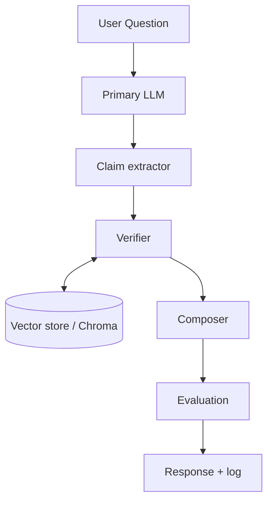

# Hallucination Guardrail Meta-Agent – Architecture

## High-level flow

```
User Question
      │
      ▼
┌─────────────────┐
│ Primary LLM     │  Answer (full response)
└────────┬────────┘
         ▼
┌─────────────────┐
│ Claim extractor │  Atomic claims
└────────┬────────┘
         ▼
┌─────────────────┐     Vector store    ┌──────────────┐
│ Verifier        │ ◄─────────────────► │ Chroma (KB)  │
│ (retrieve +     │     Evidence        │ PDF chunks   │
│  LLM judge)     │                     └──────────────┘
└────────┬────────┘
         ▼
┌─────────────────┐
│ Composer        │  Guardrailed answer (verified claims only, or refusal)
└────────┬────────┘
         ▼
┌─────────────────┐
│ Evaluation      │  Log to eval_log.jsonl
└────────┬────────┘
         ▼
      Response
```

## Diagram (Mermaid)



## Components

| Component        | Role |
|-----------------|------|
| **Primary LLM** | Answers the user question (Groq or Google). |
| **Claim extractor** | Extracts atomic factual claims from the LLM answer. |
| **Verifier** | For each claim: (1) retrieves relevant chunks from the vector store (semantic search), (2) calls an LLM judge to decide if the chunk supports the claim (TRUE/FALSE). No confidence score. |
| **Composer** | Builds the guardrailed output: either an answer using only verified claims, or "I could not find reference for this in the knowledge base." |
| **Evaluation** | Appends one JSONL line per run (question, overall_status, verified/not_verified counts). |
| **Vector store** | Chroma over PDF chunks (IPC–BNS conversion guide). Embeddings: Google or sentence-transformers. |

## State (VerificationState)

- **Input:** `question`, `llm_provider`, `llm_model`
- **After primary_llm:** `llm_answer`
- **After claim_extractor:** `claims`
- **After verifier:** `verifications` (claim, verified, evidence, source), `final_result` (overall_status, verified_claims, not_verified_claims, total_claims)
- **After composer:** `composed_answer`
- **After evaluation:** `evaluation` (logged dict)

## LLM providers

- **Groq** (default model: llama-3.3-70b-versatile)
- **Google** (default model: gemini-2.5-flash)

No offline or other providers.

## Code layout (nodes)

- **`src/nodes/agents/`** — LLM-calling nodes: `primary_llm`, `claim_extractor`, `verifier`, `composer`.
- **`src/nodes/steps/`** — Non-LLM pipeline steps: `evaluation` (logging).
- **`src/graph/`** — State and workflow definition (`state.py`, `workflow.py`).
- **`src/rag/`** — Vector store, PDF processing, `build_vector_store`.
- **`src/config.py`** — LLM config, paths, throttling.
